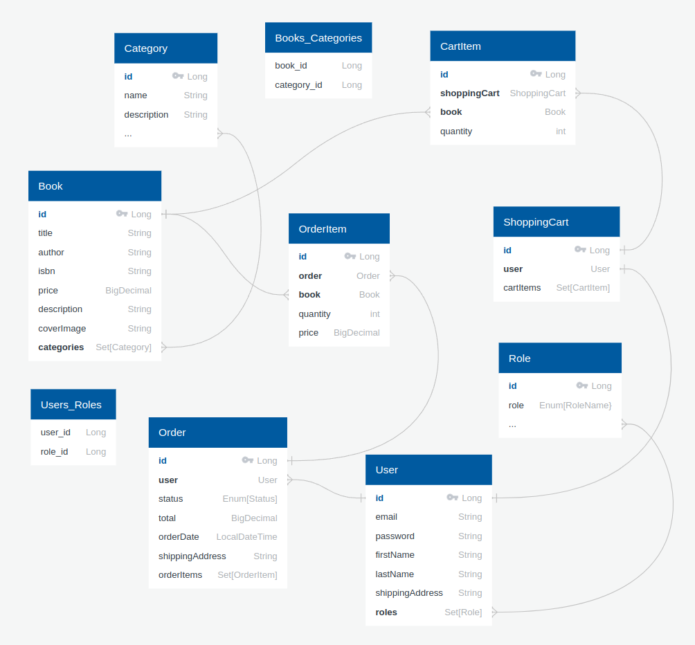

## 📘 Book Store App

Welcome to the Book Store Backend, a scalable and modular RESTful API built using Java and the Spring Boot framework.
This project is designed to support a full-featured online bookstore, providing endpoints for managing users, books,
orders, and more, with robust security and documentation in place.

The application follows a Layered Architecture to promote clean code separation, maintainability, and extensibility.
It leverages modern backend technologies and tools to streamline development, testing, deployment, and security.

---

[▶️ Watch the demo video](https://www.loom.com/share/416b8cb9eac74251ab9b1ddfdf88abba?sid=2411dc86-78db-47ec-b383-afca70e21f86)

---

You can also test this API yourself using Swagger by accessing the following link:

[Link to Swagger: BookStore.](http://ec2-44-211-209-132.compute-1.amazonaws.com/api/swagger-ui/index.html#/)

---

### Key Technologies

- **Java 17** – Primary programming language used for backend development.
- **Maven** – Dependency and build management tool for Java projects.
- **Spring Boot 3.3.2** – Rapid application development with embedded server support and production-ready configurations.
- **Spring Security 6.3.1** – Handles authentication and authorization with JWT integration.
- **Spring Data JPA 3.3.2 (Hibernate 6.5.2.Final)** – Simplifies database interactions using object-relational mapping.
- **MapStruct 1.5.5.Final** – Code generator for mapping DTOs and entities efficiently.
- **Liquibase 4.27.0** – Version control for your database schema with automated change tracking.
- **MySQL 8.0.33** – Reliable and performant relational database for persistent data storage.
- **Lombok 1.18.34** – Reduces boilerplate code in Java (e.g., getters, setters, constructors) via annotations.
- **Swagger (OpenAPI)** – Automatically generated and interactive API documentation.
- **Postman** – API testing and validation tool.
- **Docker** – Containerization for consistent deployment across environments.

---

### Architecture Overview

- This project implements a Layered Architecture:
- Controller Layer: Exposes RESTful endpoints and handles HTTP requests/responses.
- Service Layer: Contains core business logic and mediates between controllers and repositories.
- Repository Layer: Interacts with the database using Spring Data JPA.
- Model Layer: Defines domain entities and data transfer objects (DTOs).
- Security Layer: Implements JWT-based authentication and role-based access control.

---

### Features & Functionalities

The system is built on a RESTful architecture and includes the following main controllers:

**AuthenticationController**

- **POST: `/registration`** - Register new users (with role USER)
- **POST: `/login`** - Authenticate existing users with JWT

**BookController**

- **POST: `/books`** - Create a new book (only for role ADMIN)
- **GET: `/books`** - View list all available books
- **GET: `/books/{id}`** - View a book by id
- **PUT: `/books/{id}`** - Update a book by id (only for role ADMIN)
- **DELETE: `/books/{id}`** - Mark as deleted a book by id (only for role ADMIN)
- **GET: `/books/search`** - Filter books by: isbn, title, author

**OrderController**

- **POST: `/orders`** - Create a new order (only for role ADMIN)
- **GET: `/orders`** - View list all available orders
- **GET: `/orders/{id}`** - View an order by id
- **GET: `/orders/{orderId}/items/{itemId}`** - View an item by itemId in the order by orderId
- **PATCH: `/orders/{id}`** - Change status order by id (only for role ADMIN)

**CategoryController**

- **POST: `/categories`** - Create a new category (only for role ADMIN)
- **GET: `/categories`** - View list all available categories
- **GET: `/categories/{id}`** - View a category by id
- **PUT: `/categories/{id}`** - Update a category by id (only for role ADMIN)
- **DELETE: `/categories/{id}`** - Mark as deleted a category by id (only for role ADMIN)
- **GET: `/categories/{id}/books`** - View list of books by category id

**ShoppingCartController**

- **POST: `/cart`** - Add the item to shopping cart
- **GET: `/cart`** - View all items in the shopping cart
- **PUT: `/cart/items/{id}`** - Update the quantity item by id in the shopping cart
- **DELETE: `/cart/{id}`** - Delete the item by id in shopping cart

---

### Database Schema Relationship Diagram



---

###  Fork and Clone a Project on GitHub

Forking creates a personal copy of someone else's repository under your GitHub account.

- [Go to the GitHub page of the repository you want to fork](https://github.com/StarAntonU/bookstore)
- Click the "Fork" button in the upper-right corner
- Select your GitHub account (or organization) to create the fork

  You now have your own copy of the project.

Make sure you have Git installed on your machine

- You can check by running:
```
git --version
```

Cloning downloads your forked project to your local machine so you can run or work on it.

- On your forked repository page (on your GitHub account), click the "Code" button
- Copy the URL under HTTPS or SSH
- Open a terminal (or Git Bash) on your computer
- Run the following command
```
git clone https://github.com/StarAntonU/bookstore.git
```

---

### How to Launch a Spring Boot Application with Maven

Before running the application, ensure the following tools are installed and available:
- Java (17 or compatible)
```
java -version
```
- Maven (3.8+ recommended)
```
mvn -version
```
- Docker
```
docker --version
```
Open the Terminal
- Open a terminal or command prompt on your computer

Navigate to the Project Folder
- Use the cd command to move into the folder that contains your Spring Boot project (the folder with the pom.xml file):
```
cd path/to/your/project
```
*Example:*
```
cd ~/Documents/bookstore
```

Before running the project, create .env file in the root directory with the required credentials

*Example:*
```
MYSQLDB_USER=your_data
MYSQLDB_ROOT_PASSWORD=your_data
MYSQLDB_DATABASE=your_data
MYSQLDB_LOCAL_PORT=your_data
MYSQLDB_DOCKER_PORT=your_data
SPRING_LOCAL_PORT=your_data
SPRING_DOCKER_PORT=your_data
DEBUG_PORT=your_data
JWT_EXPIRATION=your_data
JWT_SECRET=your_data
```

Run the Application Using Maven
- Use the following command to launch the Spring Boot application:
```
mvn spring-boot:run
```
Verify the Application is Running
- If successful, you will see logs ending with something like:
```
Started BookstoreApplication in X.XXX seconds (process running for X.XXX)
```
Now that Spring Boot application is running, you can use Postman (or any other REST client) to test its API endpoints.

---


### Getting Started with API with Postman

Make sure Postman is installed on your local machine before starting API testing.

+ To get started, you must authenticate as an admin and obtain a JWT token.

*Method:* **POST** `http://localhost:8088/api/auth/login`

*Example body:*

```
{
"email": "admin@email.com", 
"password": "1234"
}
 ```

+ After you authenticate and get a JWT token, you can create a category.
+ Don’t forget add your token in the Authorization header as a Bearer Token every time.

*Method* **POST** `http://localhost:8088/api/categories`

*Example body:*

```
{
"name": "Classic", 
"description": "Good books"
}
```

+ Once you've created a category, you can add a new book.

*Method* **POST** `http://localhost:8088/api/books`

*Example body:*

```
{
"title": "Kobzar",
"author": "Shevchenko",
"isbn": "1234567890",
"price": 123.45,
"description": "A good book",
"coverImage": "example.com/cover.jpg",
"categories": [1]
} 
```

**Also as an Admin you can:**

+ View all books
+ Get book details by ID
+ Create, update, or delete books
+ Search books by parameters
+ Manage categories: create, update, delete, view
+ Manage orders: view all, update status

To continue testing as a regular user, you need to register a new account.

*Method* **POST** `http://localhost:8088/api/auth/registration`

*Example body:*

```
{
"email": "bob.doe@example.com",
"password": "12345",
"repeatedPassword": "12345",
"firstName": "Bob",
"lastName": "Doe",
"shippingAddress": "123 Main St, City"
}
```

+ After registering a new user, you need to log in to obtain a JWT token.

*Method* **POST** `http://localhost:8088/api/auth/login`

*Example body:*

```
{
"email": "bob.doe@example.com",
"password": "12345"
}
```

+ After getting the token, you can add a book to your shopping cart
+ Just don’t forget to include the token in the Authorization header as a Bearer token every time.

*Method* **POST** `http://localhost:8088/api/cart`

*Example body:* 
```
{
"bookId": 1,
"quantity": 1
}
```

+ Before creating an order, you can review your shopping cart to ensure everything is correct.

*Method* **GET** `http://localhost:8088/api/cart`

+ If something is wrong with your selection, you can delete books from your shopping cart or change their quantity.

*Method* **DELETE** `http://localhost:8088/api/cart/{book_id}`

*Method* **PUT** `http://localhost:8088/api/cart//items/{book_id}`

*Example body:*
```
{
"quantity": 3
}
```

+ Now we can place an order.

*Method* **POST** `http://localhost:8088/api/orders`

*Example body:* 
```
{
"shippingAddress": "12 Main St. Kyiv"
}
```

+ We can review all our orders.

*Method* **GET** `http://localhost:8088/api/orders`

**Also as a User you can:**

+ Review all books
+ Get books by ID or search by parameters
+ Review all categories
+ Get books by ID
+ Get books by category
+ Get order by ID

---

### All Postman collections:

**AuthenticationController**

- **POST:** `http://localhost:8088/api/auth/registration` - Register new users (with role USER)
- **POST:** `http://localhost:8088/api/auth/login` - Authenticate existing users with JWT

**BookController**

- **POST:** `http://localhost:8088/api/books` - Create a new book (only for role ADMIN)
- **GET:** `http://localhost:8088/api/books` - View list all available books
- **GET:** `http://localhost:8088/api/books/1` - View a book with id 1
- **PUT:** `http://localhost:8088/api/books/1` - Update a book with id 1 (only for role ADMIN)
- **DELETE:** `http://localhost:8088/api/books/1` - Mark as deleted a book with id 1 (only for role ADMIN)
- **GET:** `http://localhost:8088/api/books/search` - Filter books by: isbn, title, author

**OrderController**

- **POST:** `http://localhost:8088/api/orders` - Create a new order (only for role ADMIN)
- **GET:** `http://localhost:8088/api/orders` - View list all available orders
- **GET:** `http://localhost:8088/api/orders/1` - View an order with id 1
- **GET:** `http://localhost:8088/api/orders/1/items/2` - View an item with id 2 in the order with id 1
- **PATCH:** `http://localhost:8088/api/orders/1` - Change status order with id 1 (only for role ADMIN)

**CategoryController**

- **POST:** `http://localhost:8088/api/categories` - Create a new category (only for role ADMIN)
- **GET:** `http://localhost:8088/api/categories` - View list all available categories
- **GET:** `http://localhost:8088/api/categories/1` - View a category with id 1
- **PUT:** `http://localhost:8088/api/categories/1` - Update a category with id 1 (only for role ADMIN)
- **DELETE:** `http://localhost:8088/api/categories/1` - Mark as deleted a category with id 1 (only for role ADMIN)
- **GET:** `http://localhost:8088/api/categories/1/books` - View list of books with category id 1

**ShoppingCartController**

- **POST:** `http://localhost:8088/api/cart` - Add the item to shopping cart
- **GET:** `http://localhost:8088/api/cart` - View all items in the shopping cart
- **PUT:** `http://localhost:8088/api/cart/items/1` - Update the quantity item with id 1 in the shopping cart
- **DELETE:** `http://localhost:8088/api/cart/1` - Delete the item with id 1 in shopping cart

---
